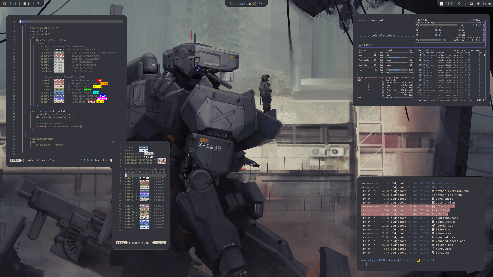
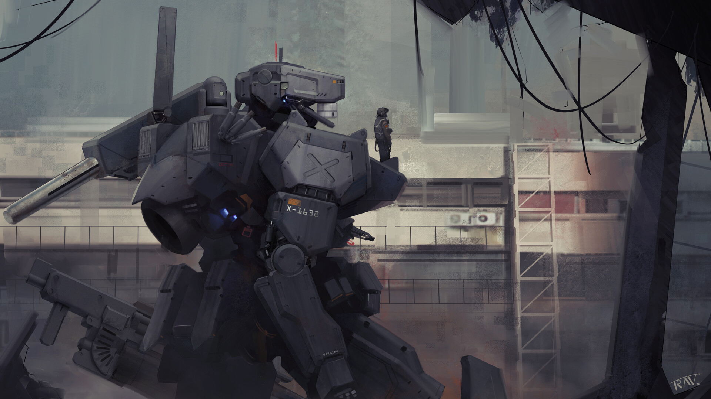
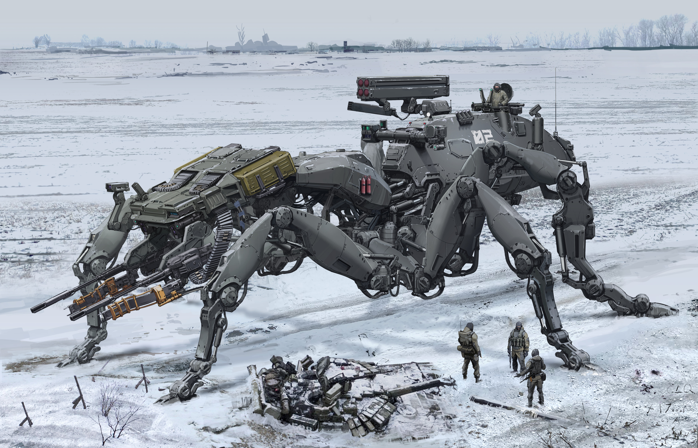
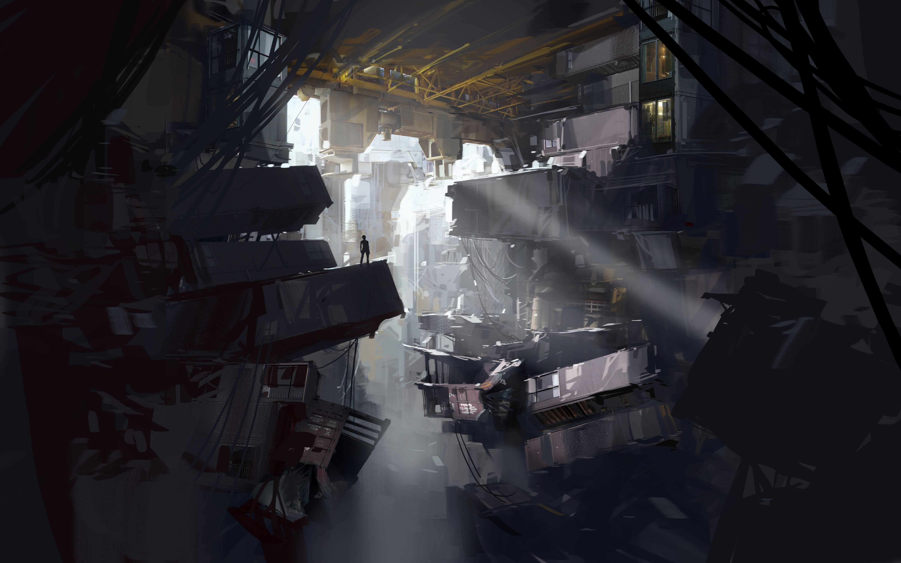
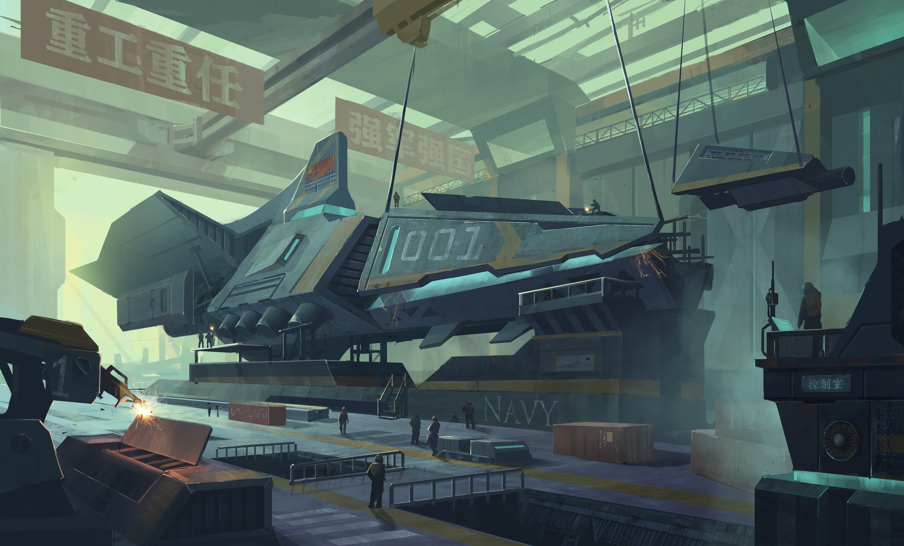

# Omarchy X-1632 Theme

X-1632 is a muted industrial palette of slate, ash, and olive with steel-blue accents. It keeps contrast restrained for a low-glare, utilitarian desktop.

## Preview



## Install

Use the Omarchy theme installer:

```bash
omarchy-theme-install https://github.com/OldJobobo/omarchy-x-1632-theme
```

## What's included

- Hyprland rules and opacity tuning (`hyprland.conf`)
- Waybar theme (`waybar-theme/`)
- Terminal palette (`colors.toml`) and Warp (`warp.yaml`)
- Shell/tools: Fish colors (`colors.fish`), fzf (`fzf.fish`)
- Apps/UI: GTK (`gtk.css`), Wofi (`wofi.css`), Walker (`walker.css`)
- System tools: cava (`cava_theme`), SwayOSD (`swayosd.css`)
- Extras: Steam (`steam.css`), Vencord (`vencord.theme.css`), icons pointer (`icons.theme`)
- Aether theme overrides (`aether.override.css`, `aether.zed.json`)
- Neovim colors (`neovim.lua`)

## Wallpapers

| | | |
| --- | --- | --- |
|  |  |  |
|  |  |  |
